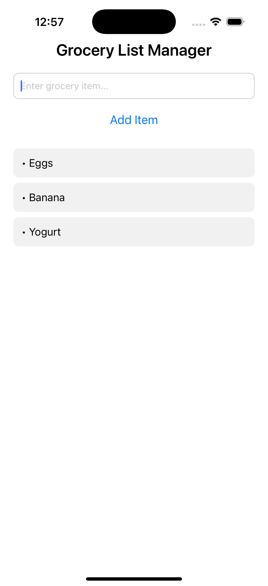
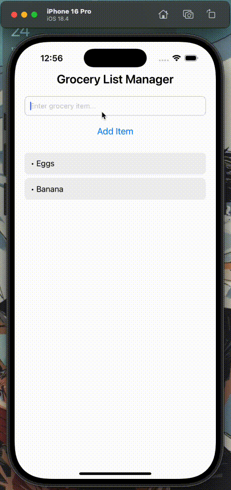

# Grocery List Manager

## Design and Purpose

**Grocery List Manager** is a simple and intuitive mobile application built with React Native and TypeScript. It helps users efficiently track the items they need to purchase while grocery shopping. The app is designed for everyday consumers who want a clean and functional interface to manage their shopping needs without unnecessary complexity.

The app allows users to:
- Add grocery items dynamically
- View a scrollable list of added items
- Avoid adding empty or duplicate entries

## ✅ Basic Use

1. **Add an Item**: Use the input field at the top of the screen to type a grocery item. Press the "Add" button to insert the item into your list.
2. **View List**: Your grocery list is displayed below the input. Scroll through it as needed.
3. **Input Validation**: The app prevents users from submitting empty input fields or adding duplicate entries.

### Core Features:
- Built using **TypeScript** and **React Native**
- Uses core components: `View`, `Text`, `TextInput`, `Button`, `FlatList`, and `StyleSheet`
- Error handling for input validation
- Responsive layout with basic styling

## Screenshots

> _Note: Add actual screenshots after running the app on an emulator or real device._

### Screenshot

### App Demo

## 🧑‍💻 Tech Stack

- **React Native**
- **TypeScript**
- **Expo (optional)**
- Core Components: `View`, `Text`, `TextInput`, `Button`, `FlatList`, `StyleSheet`

---