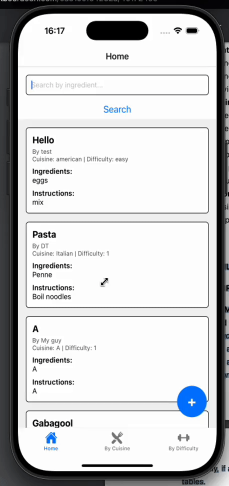

# Recipe Book App

**Team Members**:  
- Dallas Thompson III  

---

## App Overview

The Recipe Book App allows users to submit and browse recipes by cuisine, difficulty, or keyword. Designed to help aspiring chefs and home cooks organize and explore meals, this app demonstrates full-stack development using a **React Native frontend** and **PHP backend APIs**

---

## ⚛️ Front-End (React Native + TypeScript)

### Main Features:
- **Submit Recipe** – Floating Action Button (FAB) opens a modal form to submit new recipes.
- **View All Recipes** – Displays a scrollable list of submitted recipes using reusable cards.
- **Search by Ingredient** – Users can search recipes by keyword using a dynamic search bar.
- **Filter by Cuisine** – Displays recipes filtered by cuisine type (e.g., Italian, Thai).
- **Filter by Difficulty** – Displays recipes filtered by difficulty level (e.g., Easy, Hard).

### Components & Structure:
- `HomeScreen.tsx` – Handles recipe display, search input, and refresh after submission.
- `SubmitRecipeComponent.tsx` – FAB and modal form for submitting recipes.
- `SearchBar.tsx` – Reusable search input component.
- `ViewAllRecipesScreen.tsx` – Recipe list display using FlatList and custom cards.
- `RecipeCard.tsx` – Reusable UI component for individual recipe entries.

### Tech Stack:
- React Native (Expo)
- TypeScript
- React Navigation
- SafeAreaView + Modal + FlatList

---

## Backend APIs (PHP)

### POST:
- `submitRecipe.php` – Accepts recipe form data and saves it as a JSON file in a `recipes/` directory.

### GET:
- `getAllRecipes.php` – Returns all stored recipes.
- `getRecipesByCuisine.php?cuisine=Thai` – Filters recipes by cuisine.
- `getRecipesByDifficulty.php?level=Easy` – Filters recipes by difficulty.
- `searchRecipes.php?ingredient=chicken` – Returns recipes containing a specific ingredient.

> All responses use `application/json` format for compatibility with the mobile frontend.

---

## Server APIs

### `submitRecipe.php` – `POST`

**Description:** Accepts a new recipe via POST and saves it as a `.json` file.

- **Method:** `POST`  
- **Content-Type:** `application/json`  
- **Body Parameters:**

```json
{
  "username": "Dallas",
  "title": "Avocado Toast",
  "ingredients": "Bread, Avocado, Salt, Lemon",
  "instructions": "Toast bread. Mash avocado. Combine.",
  "cuisine": "American",
  "difficulty": "Easy"
}
```

- Example Response:

```json
{
  "success": true,
  "message": "Recipe saved successfully."
}
```

### `getAllRecipes.php` - `GET`

**Description:** Returns an array of all submitted recipes.

- Example Response

```json
[
  {
    "username": "Dallas",
    "title": "Avocado Toast",
    "ingredients": "Bread, Avocado, Salt, Lemon",
    "instructions": "Toast bread. Mash avocado. Combine.",
    "cuisine": "American",
    "difficulty": "Easy"
  }
]
```

### `getRecipesByCuisine.php?cuisine=Thai` – `GET`

**Description:** Filters recipes by cuisine.

- Example Response

```json
[
  {
    "username": "Mai",
    "title": "Pad Thai",
    "ingredients": "Rice noodles, Tofu, Peanuts",
    "instructions": "Stir-fry noodles with sauce.",
    "cuisine": "Thai",
    "difficulty": "Medium"
  }
]
```

### `getRecipesByDifficulty.php?level=Easy` – `GET`

**Description:** Filters recipes by difficulty.

- Example Response

```json
[
  {
    "username": "Alex",
    "title": "Scrambled Eggs",
    "ingredients": "Eggs, Butter, Salt",
    "instructions": "Whisk and cook on low heat.",
    "cuisine": "American",
    "difficulty": "Easy"
  }
]
```

### `searchRecipes.php?ingredient=chicken` – `GET`

**Description:** Searches for recipes containing a specific ingredient keyword.

- Example Response

```json
[
  {
    "username": "Jess",
    "title": "Chicken Alfredo",
    "ingredients": "Chicken, Cream, Pasta",
    "instructions": "Cook chicken. Mix with sauce and pasta.",
    "cuisine": "Italian",
    "difficulty": "Medium"
  }
]
```

---

### Demo:

